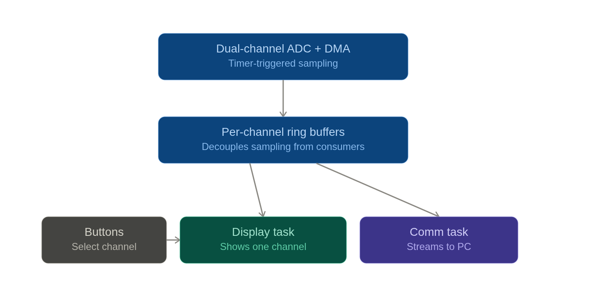

# SimpleScope

A dual-channel oscilloscope project for the STM32F407 microcontroller. It acquires interleaved ADC samples, selects channels, renders waveforms on an SSD1306 OLED, and prepares sample packets for transmission.

For a detailed refresher on the architecture, hardware data path, current status, and next implementation steps, see [ARCHITECTURE.md](ARCHITECTURE.md).

## Architecture Overview



## Project Structure

### Application Modules (`app/`)

The main application logic is implemented in the app folder and integrated into the system via `Core/Src/main.c`.

- **Scope App** (`scope_app.h/c`)
  - Reserved for application orchestration

- **Acquisition** (`acquisition.h/c`)
  - Shared dual-channel ADC DMA buffer
  - Half/full transfer callbacks

- **Channels** (`channels.h/c`)
  - Channel selection and button/LED state

- **Display** (`display.h/c`)
  - Renders selected interleaved ADC samples into the framebuffer
  - Updates the SSD1306 display

- **Communication** (`communication.h/c`)
  - Creates and transmits validated sample packets

- **Configuration** (`config.h`)
  - Application-wide configuration constants

### Hardware Drivers

- **SSD1306 OLED Display** (`Drivers/SSD1306/`)
  - Graphics and font support
  - Hardware abstraction layer

- **STM32F4 HAL** (`Drivers/STM32F4xx_HAL_Driver/`)
  - Hardware abstraction for ADC, DMA, Timer, GPIO
  - USB Host support via Middlewares

### Core System

- **Main** (`Core/Src/main.c`)
  - System initialization and main loop
  - STM32F407 system configuration

## Hardware Platform

- **MCU**: STM32F407VG (ARM Cortex-M4)
- **Display**: SSD1306 OLED (128x64, I2C/SPI)
- **Acquisition**: Dual ADC channels with DMA
- **Communication**: USB Host support

## Tests

Run the display unit test on the host:

```bash
gcc -std=c11 -Wall -Wextra -Werror \
  -Itests/host -Iapp/Inc -IDrivers/SSD1306/Inc \
  tests/test_display.c app/Src/display.c \
  Drivers/SSD1306/Src/ssd1306_gfx.c Drivers/SSD1306/Src/fonts.c \
  -o /tmp/test_display && /tmp/test_display
```

## Build System

- **CMake** 3.22+
- **ARM GCC** (arm-none-eabi)
- Generates build files in `build/Debug/`
